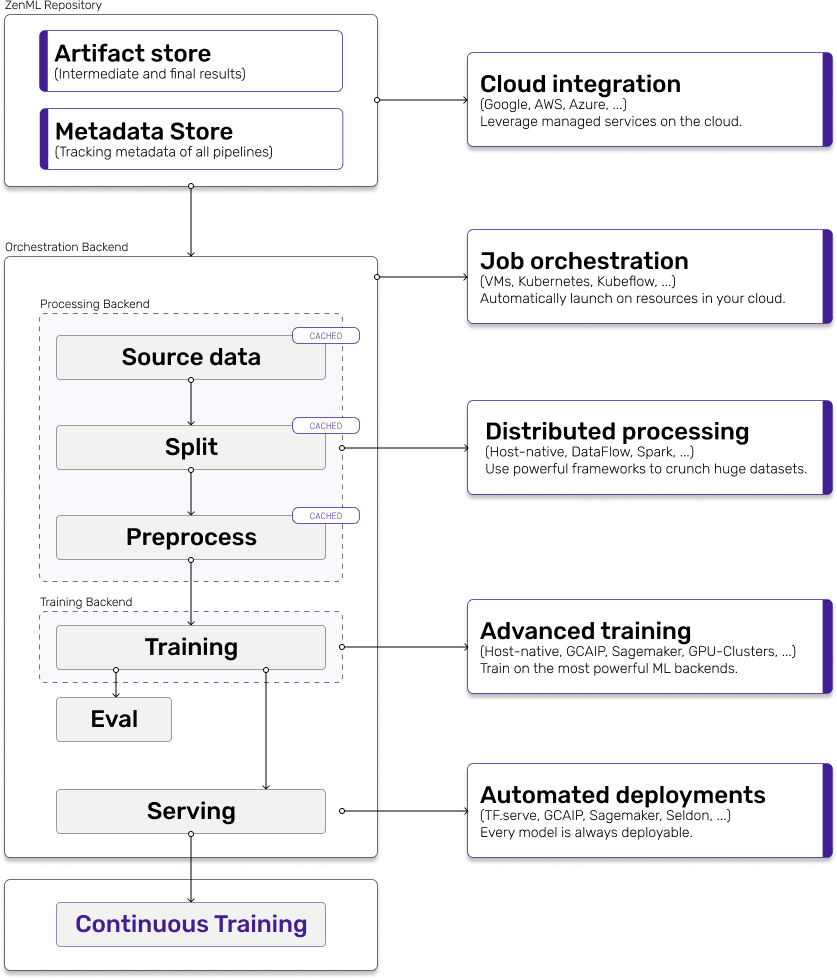

# Core Concepts



### Important considerations

[Artifact](core-concepts.md#artifact-store) and [Metadata stores](core-concepts.md#metadata-store) can be configured per repository as well as per pipeline. However, only pipelines with the same Artifact and Metadata store are comparable, and therefore should not change to maintain the benefits of caching and consistency across pipeline runs.

On a high level, when data is read from a datasource the results are persisted in your artifact store. An orchestration integration reads the data from the artifact store and begins preprocessing - either itself, or alternatively on a dedicated processing backend like [Google Dataflow](https://cloud.google.com/dataflow). Every pipeline step reads it's predecessors result artifacts from the artifact store and writes it's own result artifacts to the artifact store. Once preprocessing is done, the orchestration begins the training of your model - again either itself or on a dedicated training backend. The trained model will be persisted in the artifact store, and optionally passed on to a serving backend.

A few rules apply:

* Every orchestration backend \(local, [Google Cloud VMs](core-concepts.md), etc\) can run all pipeline steps, including training, of pipelines. 
* Orchestration backends have a selection of compatible processing backends.
* Pipelines can be configured to utilize more powerful processing \(e.g. distributed\) and training \(e.g. Google AI Platform\) backends. 

A quick example for large data sets makes this clearer. By default, your experiments will run locally. Pipelines on large datasets would be severely bottlenecked, so you can configure Google Dataflow as a processing backend for distributed computation, and Google AI Platform as a training backend.

### System design

The design choices in ZenML follow the understanding that production-ready model training pipelines need to be immutable, repeatable, discoverable, descriptive, and efficient. ZenML takes care of the orchestration of your pipelines, from sourcing data all the way to continuous training - no matter if its running somewhere locally, in an on-premise data center, or in the Cloud.

In different words, ZenML runs your **ML** code while taking care of the "**Op**eration**s**" for you. It takes care of:

* Interfacing between the individual processing steps \(splitting, transform, training\). 
* Tracking of intermediate results and metadata/ 
* Caching your processing artifacts.
* Parallelization of computing tasks.
* Ensuring immutability of your pipelines from data sourcing to model artifacts.
* No matter where - Cloud, On-Premise, or locally.

Since production scenarios often look complex, ZenML is built with integrations in mind. ZenML supports an ever-growing [range of integrations](https://github.com/maiot-io/zenml/tree/9c7429befb9a99f21f92d13deee005306bd06d66/docs/book/getting-started/benefits/integrations.md) for processing, training, and serving, and you can always add custom integrations via our extensible interfaces.

## Key components

ZenML consists of the following key components:

### Repository

A repository is the foundation of all ZenML activity. Every action that can be executed within ZenML has to necessarily take place within a ZenML repository. ZenML repositories are inextricably [tied to git](core-concepts.md).

### Datasources

Datasources are the heart of any machine learning process, and thats why they are first-class citizens in ZenML. While every pipeline takes one as input, a datasource can also be created independently of a pipeline. The important part to note is that a datasource is only really registered in the ZenML repository when it is run at least once as part of a pipeline. At that moment, an immutable snaphot of the data is created, versioned and tracked in the artifact and metadata store respectively.

### Pipelines

A ML pipeline is sequence of tasks that execute in a specific order and yield ML artifacts. The artifacts are stored within the artifact store and indexed via the metadata store \(see below\). Each individual task within a pipeline is known as a `Step`. The standard pipelines \(like `TrainingPipeline`\) within ZenML are designed to have easy interfaces to add pre-decided steps, with the order also pre-decided. Other sorts of pipelines can be created as well from scratch.

The moment it is `run`, a pipeline is converted to an immutable, declarative YAML configuration file, stored in the pipelines directory \(see below\). These YAML files may be persisted within the git repository as well, or kept separate.

### Steps

A step is one part of a ZenML pipeline, that is responsible for one aspect of processing the data. Steps can be thought of as hierarchical: There are broad step types like `SplitStep`, `PreprocesserStep`, `TrainerStep` etc., which defined `interfaces` for specialized implementations of these concepts.

As an example, lets look at the `TrainerStep`. Here is the heirarchy:

```text
BaseTrainerStep
│   
└───TensorflowBaseTrainer
│   │   
│   └───TensorflowFeedForwardTrainer
│   
└───PyTorchBaseTrainer
    │   
    └───PyTorchFeedForwardTrainer
```

Each layer defines its own special interface that are essentially placeholder functions to override. So, someone looking to create a custom trainer step should sub-class the appropriate class based on the users requirements.

### Backends

If datasources represent the data you use, and pipelines+steps define the code you use, backends define the configuration and environment  
with which everything comes together. Backends give the freedom to separate infrastructure from code, which is so crucial in production environments. They define where and how the code runs.

Backends are defined either per pipeline \(here they are called `OrchestratorBackends`\), or per step \(i.e. `ProcessingBackends`, `TrainingBackends`\).

Read more about backends [here](advanced-guide/backends.md#how-to-use-a-backend).

### Pipelines Directory

A pipelines directory is where all the declarative configurations of all pipelines run within a ZenML repository are stored. These declarative configurations are the source of truth for everyone working in the repository and therefore serve as a database to track not only pipelines, but steps, datasources and backends, including all configuration.

### Artifact Store

Pipelines when run have steps that produce artifacts. These artifacts are stored in the Artifact Store. Artifacts themselves can be of many types, such as [TFRecords](https://www.tensorflow.org/tutorials/load_data/tfrecord) or saved model pickles, depending on what the step produces.

### Metadata Store

The configuration of each datasource, pipeline, step, backend, and produced artifacts are all tracked within the metadata store. The metadata store is SQL database, and can be `sqlite` or `mysql`.

