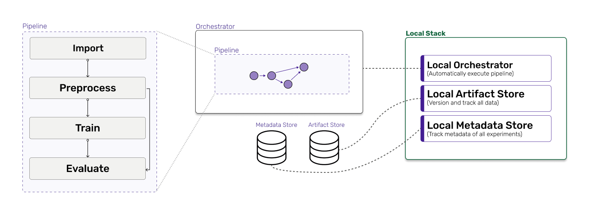

# Deploy to production

If you want to see the code for this chapter of the guide, head over to the [GitHub](https://github.com/zenml-io/zenml/tree/main/examples/low\_level\_guide/chapter\_7.py).

## Deploy pipelines to production

When developing ML models, your pipelines will, at first, most probably live on your machine with a local [Stack](../../core-concepts.md). However, at a certain point when you are finished with its design, you might want to transition to a more production-ready setting, and deploy the pipeline to a more robust environment.

### Install and configure Airflow

This part is optional, and it would depend on your pre-existing production setting. For example, for this guide, Airflow will be set up from scratch and set up to work locally, however you might want to use a managed Airflow instance like [Cloud Composer](https://cloud.google.com/composer) or [Astronomer](https://astronomer.io).

For this guide, you'll want to make sure airflow is installed before continuing:

```shell
pip install apache_airflow==2.2.0
```

### Creating an Airflow Stack

A [Stack](../../core-concepts.md) is the configuration of the surrounding infrastructure where ZenML pipelines are run and managed. For now, a `Stack` consists of:

* A metadata store: To store metadata like parameters and artifact URIs
* An artifact store: To store interim data step output.
* An orchestrator: A service that actually kicks off and runs each step of the pipeline.

When you did `zenml init` at the start of this guide, a default `local_stack` was created with local version of all of these. In order to see the stack you can check it out in the command line:

```shell
zenml stack list
```

Output:

```bash
STACKS:
key          stack_type    metadata_store_name    artifact_store_name    orchestrator_name
-----------  ------------  ---------------------  ---------------------  -------------------
local_stack  base          local_metadata_store   local_artifact_store   local_orchestrato
```



Let's stick with the `local_metadata_store` and a `local_artifact_store` for now and create an Airflow orchestrator and corresponding stack.

```shell
zenml orchestrator register airflow_orchestrator airflow
zenml stack register airflow_stack \
    -m local_metadata_store \
    -a local_artifact_store \
    -o airflow_orchestrator
zenml stack set airflow_stack
```

Output:

```bash
Orchestrator `airflow_orchestrator` successfully registered!
Stack `airflow_stack` successfully registered!
Active stack: airflow_stack
```



In the real-world we would also switch to something like a MySQL-based metadata store and a Azure/GCP/S3-based artifact store. We have just skipped that part to keep everything in one machine to make it a bit easier to run this guide.


### Starting up Airflow

ZenML takes care of configuring Airflow, all we need to do is run:

```bash
zenml orchestrator up
```

This will bootstrap Airflow, start up all the necessary components and run them in the background. When the setup is finished, it will print username and password for the Airflow webserver to the console.


If you can't find the password on the console, you can navigate to the `APP_DIR / airflow / airflow_root / STACK_UUID / standalone_admin_password.txt` file. The username will always be `admin`.

* APP\_DIR will depend on your os. See which path corresponds to your OS [here](https://click.palletsprojects.com/en/8.0.x/api/#click.get\_app\_dir).
* STACK\_UUID will be the unique id of the airflow\_stack. There will be only one folder here so you can just navigate to the one that is present.


### Run

The code from this chapter is the same as the last chapter. So run:

```python
python chapter_7.py
```

Even through the pipeline script is the same, the output will be a lot different from last time. ZenML will detect that `airflow_stack` is the active stack, and do the following:

* `chapter_7.py` will be copied to the Airflow `dag_dir` so Airflow can detect is as an [Airflow DAG definition file](https://airflow.apache.org/docs/apache-airflow/stable/tutorial.html#it-s-a-dag-definition-file).
* The Airflow DAG will show up in the Airflow UI at [http://0.0.0.0:8080](http://0.0.0.0:8080). You will have to login with the username and password generated above.
* The DAG name will be the same as the pipeline name, so in this case `mnist_pipeline`.
* The DAG will be scheduled to run every minute.
* The DAG will be un-paused so you'll probably see the first run as you click through.

And that's it: As long as you keep Airflow running now, this script will run every minute, pull the latest data, and train a new model!

We now have a continuously training ML pipeline training on new data every day. All the pipelines will be tracked in your production [Stack's metadata store](../../core-concepts.md), the interim artifacts will be stored in the [Artifact Store](../../core-concepts.md), and the scheduling and orchestration is being handled by the [orchestrator](../../core-concepts.md), in this case Airflow.

### Shutting down Airflow

Once we are done experimenting, we need to shut down Airflow by running:

```bash
zenml orchestrator down
```

## Conclusion

If you made it this far, congratulations! You're one step closer to being production-ready with your ML workflows! Here is what we achieved in this entire guide:

* Experimented locally and built-up a ML pipeline.
* Transitioned to production by deploying a continuously training pipeline on newly arriving data.
* All the while retained complete lineage and tracking over parameters, data, code, and metadata.

### Coming soon

There are lot's more things you do in production that you might consider adding to your workflows:

* Adding a step to automatically deploy the models to a REST endpoint.
* Setting up a drift detection and validation step to test models before deploying.
* Creating a batch inference pipeline to get predictions.

ZenML will help with all of these and above -> Watch out for future releases and the next extension of this guide coming soon!
