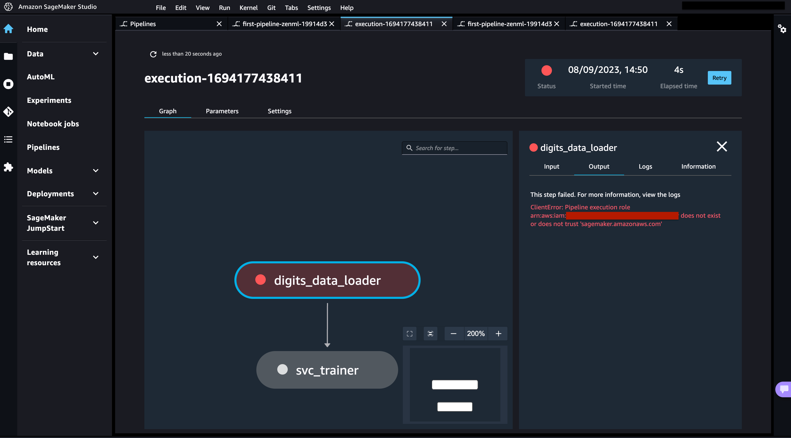
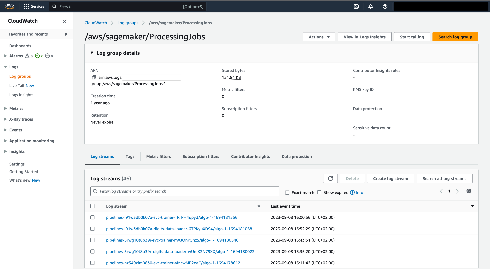

# AWS Sagemaker Orchestrator

[Sagemaker Pipelines](https://aws.amazon.com/sagemaker/pipelines) is a serverless ML workflow tool running on AWS. It is an easy way to quickly run your code in a production-ready, repeatable cloud orchestrator that requires minimal setup without provisioning and paying for standby compute.


This component is only meant to be used within the context of a [remote ZenML deployment scenario](../../../deploying-zenml/zenml-self-hosted/). Usage with a local ZenML deployment may lead to unexpected behavior!


## When to use it

You should use the Sagemaker orchestrator if:

* you're already using AWS.
* you're looking for a proven production-grade orchestrator.
* you're looking for a UI in which you can track your pipeline runs.
* you're looking for a managed solution for running your pipelines.
* you're looking for a serverless solution for running your pipelines.

## How it works

The ZenML Sagemaker orchestrator works with [Sagemaker Pipelines](https://aws.amazon.com/sagemaker/pipelines), which can be used to construct machine learning pipelines. Under the hood, for each ZenML pipeline step, it creates a SageMaker `PipelineStep`, which contains a Sagemaker Processing job. Currently, other step types are not supported.

## How to deploy it

In order to use a Sagemaker AI orchestrator, you need to first deploy [ZenML to the cloud](../../../deploying-zenml/zenml-self-hosted/). It would be recommended to deploy ZenML in the same region as you plan on using for Sagemaker, but it is not necessary to do so. You must ensure that you are connected to the remote ZenML server before using this stack component.

The only other thing necessary to use the ZenML Sagemaker orchestrator is enabling the relevant permissions for your particular role.

In order to quickly enable APIs, and create other resources necessary for to use this integration, we will soon provide a Sagemaker stack recipe via [our `mlstacks` repository](https://github.com/zenml-io/mlstacks), which will help you set up the infrastructure with one click.

### Infrastructure Deployment

A Sagemaker orchestrator can be deployed directly from the ZenML CLI:

```shell
zenml orchestrator deploy sagemaker_orchestrator --flavor=sagemaker --provider=aws ...
```

You can pass other configurations specific to the stack components as key-value arguments. If you don't provide a name, a random one is generated for you. For more information about how to work use the CLI for this, please refer to the dedicated documentation section.

## How to use it

To use the Sagemaker orchestrator, we need:

* The ZenML `aws` and `s3` integrations installed. If you haven't done so, run

```shell
zenml integration install aws s3
```

* [Docker](https://www.docker.com) installed and running.
* A [remote artifact store](../artifact-stores/) as part of your stack (configured with an `authentication_secret` attribute).
* A [remote container registry](../container-registries/) as part of your stack.
* An IAM role or user with [an `AmazonSageMakerFullAccess` managed policy](https://docs.aws.amazon.com/sagemaker/latest/dg/security-iam-awsmanpol.html) applied to it as well as `sagemaker.amazonaws.com` added as a Principal Service. Full details on these permissions can be found [here](https://docs.aws.amazon.com/sagemaker/latest/dg/sagemaker-roles.html) or use the ZenML recipe (when available) which will set up the necessary permissions for you.
* The local client (whoever is running the pipeline) will also have to have the necessary permissions or roles to be able to launch Sagemaker jobs. (This would be covered by the `AmazonSageMakerFullAccess` policy suggested above.)

There are three ways you can authenticate your orchestrator and link it to the IAM role you have created:



The recommended way to authenticate your SageMaker orchestrator is by registering an [AWS Service Connector](../../auth-management/aws-service-connector.md) and connecting it to your SageMaker orchestrator:

```shell
zenml service-connector register <CONNECTOR_NAME> --type aws -i
zenml orchestrator register <ORCHESTRATOR_NAME> \
    --flavor=sagemaker \
    --execution_role=<YOUR_IAM_ROLE_ARN>
zenml orchestrator connect <ORCHESTRATOR_NAME> --connector <CONNECTOR_NAME>
zenml stack register <STACK_NAME> -o <ORCHESTRATOR_NAME> ... --set
```



Instead of creating a service connector, you can also configure your AWS authentication credentials directly in the orchestrator:

```shell
zenml orchestrator register <ORCHESTRATOR_NAME> \
    --flavor=sagemaker \
    --execution_role=<YOUR_IAM_ROLE_ARN> \ 
    --aws_access_key_id=...
    --aws_secret_access_key=...
    --aws_region=...
zenml stack register <STACK_NAME> -o <ORCHESTRATOR_NAME> ... --set
```

See the [`SagemakerOrchestratorConfig` SDK Docs](https://sdkdocs.zenml.io/latest/integration\_code\_docs/integrations-aws/#zenml.integrations.aws.flavors.sagemaker\_orchestrator\_flavor) for more information on available configuration options.



If you neither connect your orchestrator to a service connector nor configure credentials explicitly, ZenML will try to implicitly authenticate to AWS via the `default` profile in your local [AWS configuration file](https://docs.aws.amazon.com/cli/latest/userguide/cli-configure-files.html).

```shell
zenml orchestrator register <ORCHESTRATOR_NAME> \
    --flavor=sagemaker \
    --execution_role=<YOUR_IAM_ROLE_ARN>
zenml stack register <STACK_NAME> -o <ORCHESTRATOR_NAME> ... --set
python run.py  # Authenticates with `default` profile in `~/.aws/config`
```




ZenML will build a Docker image called `<CONTAINER_REGISTRY_URI>/zenml:<PIPELINE_NAME>` which includes your code and use it to run your pipeline steps in Sagemaker. Check out [this page](../../../user-guide/advanced-guide/environment-management/containerize-your-pipeline.md) if you want to learn more about how ZenML builds these images and how you can customize them.


You can now run any ZenML pipeline using the Sagemaker orchestrator:

```shell
python run.py
```

If all went well, you should now see the following output:

```
Steps can take 5-15 minutes to start running when using the Sagemaker Orchestrator.
Your orchestrator 'sagemaker' is running remotely. Note that the pipeline run will only show up on the ZenML dashboard once the first step has started executing on the remote infrastructure.
```


If it is taking more than 15 minutes for your run to show up, it might be that a setup error occurred in SageMaker before the pipeline could be started. Checkout the [Debugging SageMaker Pipelines](sagemaker.md#debugging-sagemaker-pipelines) section for more information on how to debug this.


### Sagemaker UI

Sagemaker comes with its own UI that you can use to find further details about your pipeline runs, such as the logs of your steps.

To access the Sagemaker Pipelines UI, you will have to launch Sagemaker Studio via the AWS Sagemaker UI. Make sure that you are launching it from within your desired AWS region.


Once the Studio UI has launched, click on the 'Pipeline' button on the left side. From there you can view the pipelines that have been launched via ZenML:


### Debugging SageMaker Pipelines

If your SageMaker pipeline encounters an error before the first ZenML step starts, the ZenML run will not appear in the ZenML dashboard. In such cases, use the [SageMaker UI](sagemaker.md#sagemaker-ui) to review the error message and logs. Here's how:

* Open the corresponding pipeline in the SageMaker UI as shown in the [SageMaker UI Section](sagemaker.md#sagemaker-ui),
* Open the execution,
* Click on the failed step in the pipeline graph,
* Go to the 'Output' tab to see the error message or to 'Logs' to see the logs.



Alternatively, for a more detailed view of log messages during SageMaker pipeline executions, consider using [Amazon CloudWatch](https://aws.amazon.com/cloudwatch/):

* Search for 'CloudWatch' in the AWS console search bar.
* Navigate to 'Logs > Log groups.'
* Open the '/aws/sagemaker/ProcessingJobs' log group.
* Here, you can find log streams for each step of your SageMaker pipeline executions.



### Run pipelines on a schedule

The ZenML Sagemaker orchestrator doesn't currently support running pipelines on a schedule. We maintain a public roadmap for ZenML, which you can find [here](https://zenml.io/roadmap). We welcome community contributions (see more [here](https://github.com/zenml-io/zenml/blob/main/CONTRIBUTING.md)) so if you want to enable scheduling for Sagemaker, please [do let us know](https://zenml.io/slack-invite)!

### Configuration at pipeline or step level

When running your ZenML pipeline with the Sagemaker orchestrator, the configuration set when configuring the orchestrator as a ZenML component will be used by default. However, it is possible to provide additional configuration at the pipeline or step level. This allows you to run whole pipelines or individual steps with alternative configurations. For example, this allows you to run the training process with a heavier, GPU-enabled instance type, while running other steps with lighter instances.

Additional configuration for the Sagemaker orchestrator can be passed via `SagemakerOrchestratorSettings`. Here, it is possible to configure `processor_args`, which is a dictionary of arguments for the Processor. For available arguments, see the [Sagemaker documentation](https://sagemaker.readthedocs.io/en/stable/api/training/processing.html#sagemaker.processing.Processor) . Currently, it is not possible to provide custom configuration for the following attributes:

* `image_uri`
* `instance_count`
* `sagemaker_session`
* `entrypoint`
* `base_job_name`
* `env`

For example, settings can be provided in the following way:

```python
sagemaker_orchestrator_settings = SagemakerOrchestratorSettings(
    processor_args={
        "instance_type": "ml.t3.medium",
        "volume_size_in_gb": 30
    }
)
```

They can then be applied to a step as follows:

```python
@step(settings={"orchestrator.sagemaker": sagemaker_orchestrator_settings})
```

For example, if your ZenML component is configured to use `ml.c5.xlarge` with 400GB additional storage by default, all steps will use it except for the step above, which will use `ml.t3.medium` with 30GB additional storage.

Check out [this docs page](../../../user-guide/advanced-guide/pipelining-features/configure-steps-pipelines.md) for more information on how to specify settings in general.

For more information and a full list of configurable attributes of the Sagemaker orchestrator, check out the [SDK Docs](https://sdkdocs.zenml.io/latest/integration\_code\_docs/integrations-aws/#zenml.integrations.aws.orchestrators.sagemaker\_orchestrator.SagemakerOrchestrator) .

#### S3 data access in ZenML steps

In Sagemaker jobs, it is possible to [access data that is located in S3](https://docs.aws.amazon.com/sagemaker/latest/dg/model-access-training-data.html). Similarly, it is possible to write data from a job to a bucket. The ZenML Sagemaker orchestrator supports this via the `SagemakerOrchestratorSettings` and hence at component, pipeline, and step levels.

**Import: S3 -> job**

Importing data can be useful when large datasets are available in S3 for training, for which manual copying can be cumbersome. Sagemaker supports `File` (default) and `Pipe` mode, with which data is either fully copied before the job starts or piped on the fly. See the Sagemaker documentation referenced above for more information about these modes.

Note that data import and export can be used jointly with `processor_args` for maximum flexibility.

A simple example of importing data from S3 to the Sagemaker job is as follows:

```python
sagemaker_orchestrator_settings = SagemakerOrchestratorSettings(
    input_data_s3_mode="File",
    input_data_s3_uri="s3://some-bucket-name/folder"
)
```

In this case, data will be available at `/opt/ml/processing/input/data` within the job.

It is also possible to split your input over channels. This can be useful if the dataset is already split in S3, or maybe even located in different buckets.

```python
sagemaker_orchestrator_settings = SagemakerOrchestratorSettings(
    input_data_s3_mode="File",
    input_data_s3_uri={
        "train": "s3://some-bucket-name/training_data",
        "val": "s3://some-bucket-name/validation_data",
        "test": "s3://some-other-bucket-name/testing_data"
    }
)
```

Here, the data will be available in `/opt/ml/processing/input/data/train`, `/opt/ml/processing/input/data/val` and `/opt/ml/processing/input/data/test`.

In the case of using `Pipe` for `input_data_s3_mode`, a file path specifying the pipe will be available as per the description written [here](https://docs.aws.amazon.com/sagemaker/latest/dg/model-access-training-data.html#model-access-training-data-input-modes) . An example of using this pipe file within a Python script can be found [here](https://github.com/aws/amazon-sagemaker-examples/blob/main/advanced\_functionality/pipe\_bring\_your\_own/train.py) .

**Export: job -> S3**

Data from within the job (e.g. produced by the training process, or when preprocessing large data) can be exported as well. The structure is highly similar to that of importing data. Copying data to S3 can be configured with `output_data_s3_mode`, which supports `EndOfJob` (default) and `Continuous`.

In the simple case, data in `/opt/ml/processing/output/data` will be copied to S3 at the end of a job:

```python
sagemaker_orchestrator_settings = SagemakerOrchestratorSettings(
    output_data_s3_mode="EndOfJob",
    output_data_s3_uri="s3://some-results-bucket-name/results"
)
```

In a more complex case, data in `/opt/ml/processing/output/data/metadata` and `/opt/ml/processing/output/data/checkpoints` will be written away continuously:

```python
sagemaker_orchestrator_settings = SagemakerOrchestratorSettings(
    output_data_s3_mode="Continuous",
    output_data_s3_uri={
        "metadata": "s3://some-results-bucket-name/metadata",
        "checkpoints": "s3://some-results-bucket-name/checkpoints"
    }
)
```

### Enabling CUDA for GPU-backed hardware

Note that if you wish to use this orchestrator to run steps on a GPU, you will need to follow [the instructions on this page](../../../user-guide/advanced-guide/environment-management/scale-compute-to-the-cloud.md) to ensure that it works. It requires adding some extra settings customization and is essential to enable CUDA for the GPU to give its full acceleration.

<figure><figcaption></figcaption></figure>
