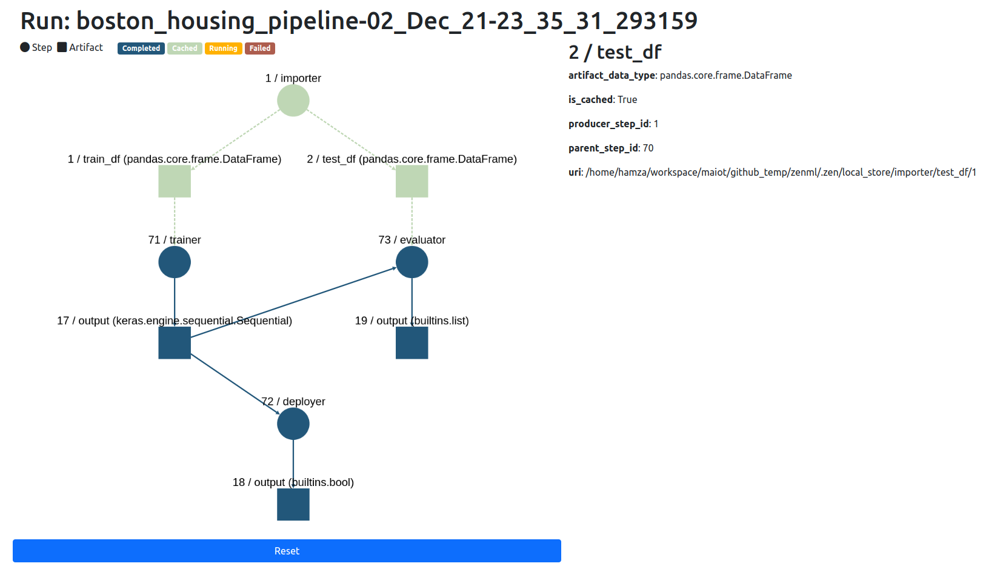

# Visualize statistics
This examples show-cases the built-in `PipelineLineageVisualizer` using the [Dash](https://dash.plotly.com/) integration. 

## Visualizers
Visualizers are Python classes that take post-execution view objects (e.g. `PipelineView`, `PipelineRunView`, `StepView`, etc.) and create 
visualizations for them. ZenML will support many standard ones but one can always extend them using the `BaseVisualization` classes.

## Overview
Here, we are using the [Boston Housing Price Regression](https://keras.io/api/datasets/boston_housing/) dataset. We create a simple pipeline that 
returns two pd.DataFrames, one for the training data and one for the test data. In the post-execution workflow we then plug in the visualization class 
that visualizes the statistics of these dataframes for us. 

This visualization is produced with the following code:

```python
from zenml.core.repo import Repository
from zenml.integrations.dash.visualizers.pipeline_run_lineage_visualizer import (
    PipelineRunLineageVisualizer,
)

repo = Repository()
pipeline = repo.get_pipelines()[-1]
PipelineRunLineageVisualizer().visualize(pipeline)
```

It produces the following visualization:




## Run it locally

### Pre-requisites
In order to run this example, you need to install and initialize ZenML:

```shell
# install CLI
pip install zenml tensorflow 
pip install dash dash-cytoscape dash-bootstrap-component

# pull example
zenml example pull lineage
cd zenml_examples/lineage

# initialize
git init
zenml init
```

### Run the project
Now we're ready. Execute:

```bash
python run.py
```

### Clean up
In order to clean up, delete the remaining ZenML references.

```shell
rm -rf zenml_examples
```
